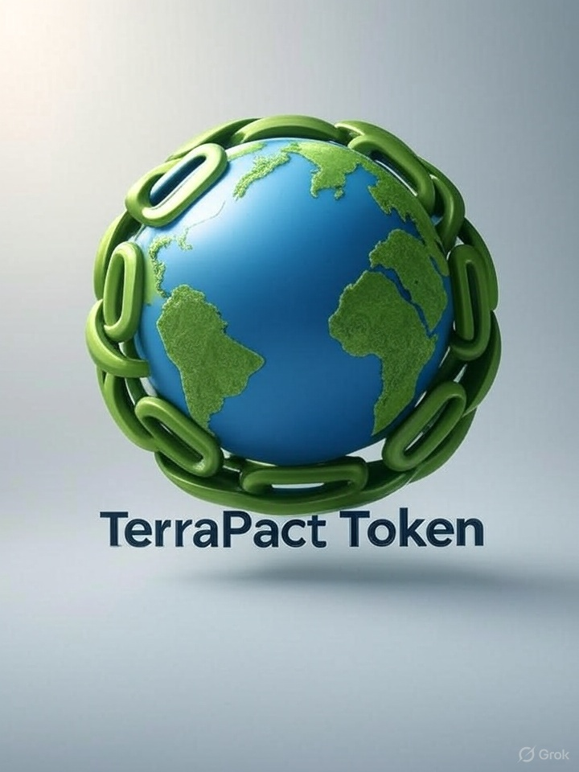

# TerraPact Token (TRPT)

## Welcome to TerraPact Token!

TerraPact Token (TRPT) is a blockchain-based cryptocurrency designed to promote global peace and environmental sustainability. Inspired by today's political challenges—like regional conflicts, climate crises, and the call for international unity—TRPT acts as a digital pact for a better world.

### Key Features:
- **Peace Fund**: 1% of every transaction supports humanitarian aid in conflict zones (e.g., Gaza peace initiatives or Ukraine relief efforts).
- **Eco-Friendly DeFi**: Built on Ethereum or Solana for low-carbon staking, yield farming, and carbon offset rewards.
- **Global Community**: Non-custodial wallet integration, peace-themed NFT drops, and DAO governance for holders.

### Roadmap:
| Phase | Timeline | Description |
|-------|----------|-------------|
| Token Launch | Q4 2025 | Listing on DEXs like Uniswap or Raydium with initial liquidity pool. |
| Partnerships | Q1 2026 | Collaborations with NGOs for transparent impact tracking on blockchain. |
| Community Growth | Ongoing | Airdrops, ESG reports, and global events. |

[Download Whitepaper (PDF)](https://raw.githubusercontent.com/TerraPact/TerraPact.github.io/main/TerraPact%20Token.pdf) | [Buy TRPT](https://dexscreener.com/search?q=TRPT) |[Join Telegram](https://t.me/TerraPact)

---
## Support TerraPact
Help fund our Peace & Green initiatives! Send USDT (TRC20) to:  
**TRPDi2rVVJ3ZmVFgXJ4V5eao2j9YihqbMH**  
All donations go 100% to humanitarian aid and sustainability projects. Track via Tronscan: [tronscan.org/#/address/TRPDi2rVVJ3ZmVFgXJ4V5eao2j9YihqbMH](https://tronscan.org/#/address/TRPDi2rVVJ3ZmVFgXJ4V5eao2j9YihqbMH).  
Thank you for joining the pact! 🌍

*© 2025 TerraPact. All rights reserved. Powered by GitHub Pages.*
